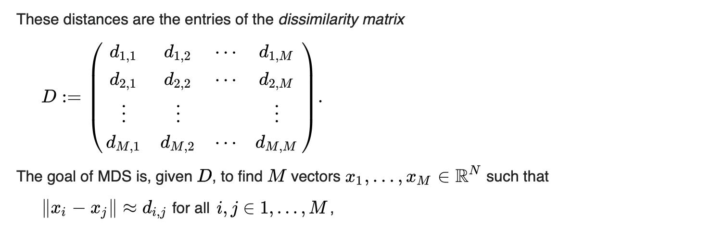

```{r setup, include=FALSE}
knitr::opts_chunk$set(echo = FALSE)
library(MVT)
library(xtable)
library(kableExtra)
library(sjPlot)
library(sjmisc)
library(sjlabelled)
library(plotly)
library(scater)
library(scran)
library(GSEABase)
library(org.Hs.eg.db)
library(DescTools)
library(scMerge)
library(scDiagnostics)
```

## Introduction

- Modern molecular biology has progressed rapidly on based primarily on the development of high throughput assays that allow us to measure tens of thousands to millions of features across large populations (e.g. cells, individuals).

- As a result we typically have data represented in arrays with N rows and M columns, where N and M are often very large.

- We are often interested in finding out if there are lower dimensional representations of the data that can be used to understand the relationships that exist.

- In this lecture we will explore some of the tools and try to get a basic understanding of how these methods work and their strengths and weaknesses.

## Rationale

- principal components provides a decomposition of the data where directions are associated with maximal variation in the data
- using these directions as a basis for identifying problems with an analysis is helpful both because of the maximality and the orthogonality 
- we can use PCA for dimension reduction, but that isn't its only use 
- in some important cases model checking is greatly simplified 

## References

- Modern Statistics for Modern Biology (Holmes and Huber); https://www.huber.embl.de/msmb/
- Elements of Statistical Learning (Hastie, Tibshirani and Friedman) https://hastie.su.domains/Papers/ESLII.pdf
- Modern Applied Statistics with S. Fourth Edition, by W. N. Venables and B. D. Ripley; MASS package in R
- CRAN https://cran.r-project.org/ Task Views
- Wikipedia pages are pretty good for a simple introduction, but often do not provide appropriate guidance/interpretation

## What is an embedding?

- there are very specific mathematical definitions 
- we will provide general thoughts/abstractions rather than abstract math
- the idea of an vector space embedding is to take high dimensional data and represent it as an element in some $p$ dimensional space
- we will use $n$ to represent the number of items we want to embed and usually use that to index the rows.
- 
- in mathematics we might start with a matrix X that has $n$ rows and $p$ columns and we want to find a representation as a different matrix Y with n rows and $k << p$ columns
- for embeddings like UMAP and t-SNE usually we consider k = 2 or 3

## AI uses of embeddings{.smaller}

- many of the recent developments in AI make use of neural networks and other algorithms to create embeddings for things that do not initially fit in to a matrix like structure
- eg. images can be processed to yield embeddings in some $k$ dimensional vector space
- text processing, like that done by large language/transformers/foundation models also fit into this framework
- given $n$ inputs we get for each a $k$ dimensional vector
- the architecture that produced the embedding typically has an ability to take any embedding and turn it back into the object
- for images you can provide a $k$ dimensional vector as input and get back an image
- for text completion (what most LLMs are base on) you put in a vector and get back a probability distribution on the next most likely word in the sentence.

<!--
## Distances and Similarities

- you will see a number of examples of classical machine learning
- classification or supervised ML - we have a labeled set of data and want to use it to apply labels to other observations where we only have features
- clustering or unsupervised ML - we have data with measured features and want to group similar individuals together
- these methods rely on some notion of similarity that can be defined between any pair of objects
- all pairwise distances between entities can be represented in a distance matrix, $D$

## Distances

- we start with data that is $X$ a matrix with M rows (one per observation) and $p$ columns (represent features measured on each of the observations)
- distances between all pairs form a matrix with $M$ rows and $M$ columns
- we want to find a representation for the data $Y$ which is say $M \times 2$ or perhaps 3
- so we can plot these lower dimensional points to visualize the data but where the distances between the points in $Y$ are *close* to the distances based on the observed data

## Multidimensional Scaling

{width=65%}

- we want to find a low dimensional representation where the distances between points in this representation are close to those in the original measurement space

- but these cannot be accurate - some corners need to be cut

-->

## Dimension reduction

- some methods emphasize distances between similar objects and do not try to constrain dissimilar objects (as long as the distances remain big)

- *warning* you typically cannot use these transformed observations for downstream analyses

- many methods and options discussed in the references

- and the tools I will go into more detail on (PCA) can usefully be adapted to understanding the distance matrices

## t-SNE

- t Stochastic neighbor embedding - another dimension reduction method

- designed with very similar objectives - find a low dimensional projection (embedding) of the data that preserves some notion of similar

- divide the data into things that are near each other and things that are far apart

- spend more effort maintaining consistent distances for those things that are near each other

- designed to have good performance on large data sets

## UMAP

 - Uniform manifold approximation and projection
 
 - it assumes that the data is uniformly distributed on a locally connected Riemannian manifold and that the Riemannian metric is locally constant or approximately locally constant (Wikipedia)
 
 - good performance, based on a formalism
 
## Diagnostics
 
 - there seems to be little research or practical approaches to answering questions of the form:  "How well does the dimensionality reduction work?"
 
 - we might want to know if there are specific features of the data that were obscured by the dimension reduction method being used
 
 
  - it seems like there are opportunites to develop tools that can help identify the effects of any processing or transforming of the data

## PCA

Principal Components Analysis is a multivariate method that helps you understand the structure of data that have been collected on $N$ individuals and $p$ variables. Each individual can be represented by a point in $p$ dimensional space. Our motivating example will be test scores on $N=88$ students across $p=5$ topics.The first two exams were closed book, the last 3 open book.

```{r data}
data(examScor)
head(examScor, n=3)
```
A motivating question is how should the exam scores be combined to give an overall score?
One answer is to use the mean, but is there something *better*? 

## Principal Components

{width=45%}

- We will refer to the data matrix as $\bf{X}$, and each row as $\bf{x_i}$ = $(x_{i,1}, x_{i,2}, \ldots,x_{i,p})$.
- We can see in the picture that we could rotate the coordinate axis to align differently with the data
- There are many possible rotations, but we want to consider one where the axis are oriented towards directions of greatest variation in the point cloud.

## Three important points

{width=45%}

- If we rotate the coordinate axis, as in the plot, the relationship between the data points has not changed at all.

- The data points are still described by a matrix ($\bf{X^\prime}$) that has $N$ rows and $p$ columns.

- The PCs are chosen to be orthogonal, just like our original coordinate system

## Other Sources
Chapter 7 of MSMB (https://www.huber.embl.de/msmb/07-chap.html) has many other examples and a slightly different approach.

They cover linear regression, other decompositions and do some really thorough explanations of the singular value decomposition that underlies this. 

My main source:  *Multivariate Analysis*, Mardia, Kent, Bibby (1979)...which is still relevant and accurate today...

## Simple PCs (Appendix for more details)

- The PCs provide us with an alternative set of coordinates. 
- The first PC corresponds to the direction of most variation in the $\bf{x}$'s.  Note that rescaling the $\bf{x}$'s would clearly affect the PCs.
- After we compute the PCs we have three quantities of interest:
  1. The variability in each of the new directions (eigenvalues).
  2. The vectors (eigenvectors) that are used to form the new coordinates (they are linear combinations of the original points).
  3. The new set of *features*, the rotated values.

## Centering and Scaling

- it is common to center the data before computing the PCA decomposition
- this essentially makes the origin in the new coordinate system correspond to the per-variable mean vector (one could use other measures of center)
- the PCs are **not invariant** to rescaling
- the argument in favor of rescaling is that it will tend to put the variables on a more equal footing
- but rescaling may be problematic in some settings (eg when some features are more important) and careful consideration of whether or not to rescale is essential

<!--
```{r exx}
 wts = runif(100, 110, 220)
 wtskg = wts/2.2
 age = runif(100, 22, 77)
 g1 = prcomp(cbind(wts, age))
 g2 = prcomp(cbind(wtskg,age))
##examine the eigenvalues and eigenvectors
```
-->

## Motivating Example

- Since we have five covariates, each student's score can be represented in 5-D space.
- The principal components give us a different coordinate system than the one based on the exam scores.
- the default for `prcomp` is to *center* but not *scale* the input

```{r pca}
v1 = prcomp(examScor)
v1
```

## How to think about the PCs

The rotation matrix, in the previous slide tells you how to compute the new, 5 dimensional values.  The first value is the linear combination where the $l_i$ come from PC1, the second from PC2, and so on.

So we can compute a new $n$ by $k$ matrix, where for each of the $k$ dimensions we can compute the new value for each individual.  This gives us a set of five columns (rows are people, columns are variables) that are equivalent to the original data. The points are in some sense identical, just we have changed coordinate systems.


## Back to the PCs
 Let's have a look at the coefficients - these are sometimes called *rotations*.
```{r}
v1$rotation
```
- We can then see that PC1 is pretty close to the average, across all the exam scores.
- PC2 is a contrast between the closed book and open book exams.
- What do you think PC3 is representing?

## The Rotated Variables

- We can also compute the data matrix in the new reference frame - sometimes called the *rotated variables*
```{r, echo=TRUE}
head( v1$x, 4)
```

## The Rotated Variables

- They are uncorrelated
```{r, echo=TRUE}
round(cor(v1$x), digits=3)
```

## The Variances


```{r echo=TRUE}
v1$sdev
```

- the largest SD is about 26 and the smallest close to 6
- if the data followed a multivariate Normal distribution (it does not) these would tell us about the size of the ellipses that describe the data

Notice that if we compute the SD for each column we get back the singular values.
```{r, echo=TRUE}
apply(v1$x, 2, sd)
```


## The Null Space

- Sometimes we have $p$ columns, but the point cloud really only occupies some lower dimensional space.
{width=30%}
- in the rotated coordinate system we only need 2 dimensions, so one of the rotated variables will be zero 

## An example of 3D data describing a 2D manifold
```{r, echo=TRUE}
x= rnorm(20, sd=10); y=rnorm(20, sd=5); z= x+y
```
```{r, echo=FALSE}
tdata = cbind(x,y,z)
head(tdata, n=3)
```
```{r, echo=TRUE}
v2 = prcomp(cbind(x,y,z))
head(v2$x, n=3)
#round(v2$sdev, digits=3)
```

## The Null Space - Dimension Reduction

- It would be quite unusual in a real world example where there is stochastic variation between individuals to find a case where one or more of the eigenvalues is exactly zero
- So we use a cut-off of some form that says that if the variability in one direction is smaller than $\eta$ we don't think that dimension will be very helpful.
- In our single cell analysis pipeline we will typically choose some fairly large number of PCs (eg 50) to use for clustering the data, this is a form of dimension reduction
- if we simply use the first 50 eigenvalues to perform the embedding then we have effectively mapped all the other directions, for all individuals, into zero

## The Effect of Outliers
- in our example we have test scores as percentages, so this limits the effect of outliers
- just to emphasize the point, I will use some very large values in the last 3 columns
- 
```{r echo=TRUE}
ns = c(1, 2, 850,950, 999)
ndata = rbind(examScor, ns)
tv = prcomp(ndata)
tv$sdev
v1$sdev
```
## The Effect of Outliers
```{r echo=T}
tv$rotation
v1$rotation
```
## The use of PCs in regression

- in regression we have a response, $\bf{y}$ that we want to model in terms of matrix, $\bf{X}$ of features.
- suppose for example that 10 students had taken the first 4 exams, but had COVID and could not take the 5th.  The instructor wants to estimate their score on the 5th exam.
```{r, echo=TRUE}
y = examScor[,5]
covs = as.matrix(examScor[,1:4])
lm1 = lm(y~covs)

```
## Regression cont'd
```{r, eval=FALSE}
tab_model(lm1) 
#summary(lm1) |>
#  xtable() |>
#  kable()
```
```
Coefficients:
               Estimate Std. Error t value Pr(>|t|)    
(Intercept)   -11.37822    6.98174  -1.630 0.106952    
covsmechanics   0.02217    0.09895   0.224 0.823265    
covsvectors     0.02574    0.13953   0.184 0.854092    
covsalgebra     0.72944    0.20961   3.480 0.000802 ***
covsanalysis    0.31293    0.13146   2.380 0.019581 *  
```
```
Residual standard error: 12.75 on 83 degrees of freedom
Multiple R-squared:  0.4793,	Adjusted R-squared:  0.4542 
F-statistic:  19.1 on 4 and 83 DF,  p-value: 3.612e-11
```
## Regression on the PCs

- now we are going to see what happens if instead of using the data in its original coordinate system we use the PCs
```{r, echo=TRUE}
pccovs = prcomp(covs)
lm2 = lm(y~pccovs$x)
```

## Regression on the PCs
```{r, eval=FALSE, echo=FALSE}
summary(lm2)
```
```
Coefficients:
            Estimate Std. Error t value Pr(>|t|)    
(Intercept) 42.30682    1.35892  31.133  < 2e-16 ***
pccovs$xPC1 -0.45441    0.05918  -7.678 2.84e-11 ***
pccovs$xPC2  0.37633    0.10885   3.457 0.000863 ***
pccovs$xPC3  0.08628    0.14739   0.585 0.559898    
pccovs$xPC4  0.52498    0.23109   2.272 0.025687 *  
```
```
Residual standard error: 12.75 on 83 degrees of freedom
Multiple R-squared:  0.4793,	Adjusted R-squared:  0.4542 
F-statistic:  19.1 on 4 and 83 DF,  p-value: 3.612e-11
```
## Regression on the PCs
- the fit of the model (and indeed the residuals, for example) is identical between the two
- the data have not changed, we just changed how we referred to the data in our coordinate system
- in the summary for `lm2` we can see that the coefficients for PC3 and PC4 are not significant
- you can check (use the rmarkdown doc for this lesson) that indeed removing them has little impact on the fit
- removing them could provide some benefits in terms of simplicity etc and this is a form of smoothing

## Reduced Model

```{r, echo=TRUE}
lm3 = lm(y~pccovs$x[,1:3])
```

```{r, echo=FALSE, eval=FALSE}
summary(lm3)
```
```
Coefficients:
                   Estimate Std. Error t value Pr(>|t|)    
(Intercept)        42.30682    1.38665  30.510  < 2e-16 ***
pccovs$x[, 1:2]PC1 -0.45441    0.06039  -7.524 5.08e-11 ***
pccovs$x[, 1:2]PC2  0.37633    0.11107   3.388  0.00107 ** 
---
Residual standard error: 13.01 on 85 degrees of freedom
Multiple R-squared:  0.4448,	Adjusted R-squared:  0.4317 
F-statistic: 34.05 on 2 and 85 DF,  p-value: 1.378e-11
```
 - note that the coefficients are identical to the values for the first model with all PCs included
 - for the model fit on the original data the variables are co-linear and removing one affects the estimates for the others

## Do we need all PCs?
- it is useful at times to determine whether most (all?) of the important variation is 
contained in the first $k$ PCs
- under an assumption that we are sampling from a multivariate Normal distribution (strong but typically it doesn't need to hold that well) we can say some things
- with real data the hypothesis that any singular value (or eigenvalue) is zero is not meaningful, we always have some amount of random variation
- but a test of $\lambda_p = \lambda_{p-1}$ is meaningful
- as is the more general $\lambda_p = \lambda_{p-1} = \ldots = \lambda_{k+1}$, which is equivalent to saying that the first $k$ components hold all the relevant information and after that it is just stochastic noise
- Section 8.4.3 of Mardia Kent and Bibby...but this does not seem to be employed in the single cell field...


## PCA in Biology

- in many different molecular biology assays we collect data on individuals or cells
- that data could be genotypes, gene expression values, methylation etc
- the data structures for these assays are usually transposed from those used above for the exam scores on students
- in biological examples there tend to be many more quantities that are measured than there are individuals
- so for most of these examples we will be working with the transpose of the data matrix
- we are often interested in finding a low dimensional set of features that explain most of the between individual variation

## Case Study with Single cell RNA-seq experiments

- In a single cell experiment we typically have hundreds to thousands of cells.
- We have 10's of thousands of genes....
- So each cell is a point in some 10-40K space...but we think that the there are useful summaries
- We want to use PCA analysis as a way to do some form of dimension reduction - to those directions where there is a lot of variation in the data.
- outliers can greatly skew the results and we need to be careful to ensure that our analysis is not too reliant on a few observations.

## The basics of the process
- get your single cell data and do QA/QC to remove genes (rows) and cells (columns) that seem to have technical or biological reasons to be be suspect
- log transform and size normalize the data
- do some sort of filtering for the top K most variable genes (K and how you measure variable are parameters)
- do PCA 
- use the first M PCs to do clustering
- revert back to the full count matrix and use UMAP and tSNE to visualize

## Set up the data

- We will examine the single cell data from workflow #3 in the OSCA book
- http://bioconductor.org/books/3.17/OSCA.workflows/
- This is a peripheral blood mononuclear cell (PBMC) dataset from 10X Genomics (Zheng et al. 2017). The data are publicly available from the 10X Genomics website, from which we download the raw gene/barcode count matrices, i.e., before cell calling from the CellRanger pipeline.
The data were processed as described in that workflow.

```{r, echo=FALSE, warning=FALSE, message=FALSE}
library("DropletTestFiles")
library("GSEABase")
library("scater")
#load("sce.pbmc.rda")
load("sc_exp_norm_trans.rda")
load("Subclusters.rda")
clusters = Subclusters
pcs = reducedDims(sc_exp_norm_trans)$PCA

```
## Variance Explained

```{r, echo=TRUE}
pct_var = attr(reducedDims(sc_exp_norm_trans)$PCA, "percentVar") |> 
   round(digits = 1)
pct_var
```
- notice that after about 12 components we are at .3 and then quickly just .2 over and over
- think back to the earlier comment that it could be useful to test if those later values are all equal...

## LM on Clusters

Here we consider a set of models, one for each PC, where we ask how much of the variation in the PC is explained by the clusters

The variables $1_{Cj}$ are indicator variables, the $i^{th}$ element is 1 if the
$i^{th}$ observation is in the $j^{th}$ cluster and 0 otherwise.

$$
 PC_l = \beta_1 \cdot 1_{C1} + \cdots + \beta_k \cdot 1_{Ck} + \epsilon
$$
We can fit this model for each of some selected number of PCs.

From previous output for this problem above we probably only need to consider the first 10 PCs.

## Output of LM: 
`lm1 = lm(pc1~clusters-1)`
<font size="3">
```{r, echo=FALSE}
##Subclusters is the set of clusters
pc1 = pcs[,1]
lm1 = lm(pc1~clusters-1)
 tab_model(lm1, show.se=TRUE, show.ci=FALSE) 
```
</font>

## Boxplot on Clusters

```{r, echo=FALSE}
boxplot(pc1~clusters, ylab="PC1", main="PC1 scores by Cluster Assignment")
```

- note that this shows PC1 is essentially a contrast between a subset of the clusters

## Is there info in the PCs we have not used?{.smaller}

- we regress each PC in turn against the cluster labels and get the multiple $R^2$
- for each regression, the multiple $R^2$ tells us about how much of the variation in that PC is explained by the clusters
- if that value is especially low, as it is for PC6 below - then that direction is not really reflecting the clustering - something else is driving the variability in that direction


```{r, echo=TRUE}
multR2 = sapply(1:9, function(x) {
  summary(lm(pcs[,x]~ clusters - 1))$adj.r.squared
})
round(multR2, digits=4)
```

## Multiple $R^2$ per PC
- note that for PC6 the multiple $R^2$ is very close to zero, suggesting that the variation in that direction is not described by the clusters 
```{r plotPCR2, echo=FALSE}
plot(1:9, round(multR2, digits=4), xlab="PC", ylab= "Prop. Var. Explained", pch=19)
```

## First PC4
- we note that for the first three PCs the $R^2$ is larger than $0.8$, but drops to around $0.6$ for PC4
- we plot PC4 vs PC1 
- what is that set of unusual looking points?
```{r, echo=FALSE}
v1 = clusters
cols = colors()[17*as.numeric(levels(v1))]
cols[10] = "red"
levels(v1) = cols
v1 = as.character(v1)
plot(pcs[,4], pcs[,1], xlab="PC4", ylab="PC1", col=v1)
```

## What is going on?

```{r, echo=TRUE}
clusters[abs(pcs[,4])>15]
table(clusters)
```
- so we see that **within** cluster 9 there is a lot of variation in the direction of PC4  
- to track this down we can ask which genes are highly variable within cluster 9


## PC4

- we now find the highly variable genes within cluster 9
- so we only use the cluster 9 cells
```{r, echo=TRUE}
exprs9 = assays(sc_exp_norm_trans)$logcounts[, clusters==9]
sdbyg9 = rowSds(exprs9)
names(sdbyg9) = row.names(exprs9)
topsdbyg9 = sort(sdbyg9,dec=TRUE)[1:50]
topsdbyg9[1:10]
```
- some of these are platelet factors, the first is a sign of platelet activation

## Platelets

- we produce a density plot of gene expression values for PPBP within cluster 9

```{r, echo=FALSE, fig.height=4}
save(exprs9, file="exprs9.rda")
plot(density(exprs9["PPBP",]), main="PPBP within cluster 9")

```

## Plot all four genes by groups

```{r, echo=FALSE}
vv = colData(sc_exp_norm_trans)
vv = cbind(vv, clusters=clusters)
colData(sc_exp_norm_trans) = vv
```

```{r, echo=FALSE}
plotExpression(sc_exp_norm_trans, features=names(topsdbyg9)[1:4], x="clusters", colour_by="clusters")
```

## Parallel Coordinate Plots

- a parallel coordinate plot is one way of showing very high dimensional data
- each dimension is encoded as a vertical line (so $k$-dimensional data has $k$ lines)
- each point $\bf{x} = (x_1, x_2, \ldots, x_k)$ is represented as a horizontal line, which joins the values $x_j$ to $x_{j+1}$
- important considerations include
    - order of the axis
    - scaling of each axis
    - any rotations
- one additional issue is that data points that share the same value for all displayed dimensions will occlude each other


```{r parallelCoord, echo=FALSE, warning=FALSE, fig.height=4}

exprs9S = data.frame(as.matrix(t(exprs9[names(topsdbyg9)[1:4],])))

##FIXME: don't hardcode the names here - things can change
```
```{r pcor, echo=FALSE, eval=FALSE}
fig <- exprs9S %>% plot_ly(type = 'parcoords',
          line = list(color = 'blue'),
          dimensions = list(
            list(range=c(0,11), label = 'PPBP', values = ~PPBP),
            list(range=c(0,11), label = 'PF4', values = ~PF4),
            list(range=c(0,11), label = 'GNG11', 
                 values = ~GNG11),
            list(range=c(0,11), label = 'SDPR', values = ~SDPR)
            )
          )

fig
```

## Parallel Coordinates plot
- one issue with this plot is that any points that have the same values across all the variables appear as one line
- 50 of the 114 are zero for all four genes
- we rescale the $y$-axis by square root - often appropriate for counts

```{r parallelCoord2, echo=FALSE, warning=FALSE, fig.height=3.5}

exprs9Ssq = sqrt(exprs9S)


fig <- exprs9Ssq %>% plot_ly(type = 'parcoords',
          line = list(color = 'blue'),
          dimensions = list(
            list(range=c(0,sqrt(11)), label = 'PPBP', values = ~PPBP),
            list(range=c(0,sqrt(11)), label = 'PF4', values = ~PF4),
            list(range=c(0,sqrt(11)), label = 'GNG11', 
                 values = ~GNG11),
            list(range=c(0,sqrt(11)), label = 'SDPR', values = ~SDPR)
            )
          )

fig
```

## Summary of our Findings about PC4

- our regression of the PCs against the cluster identities suggested that in the direction of PC4 there was some variability that was not being explained by the clusters
- we found that most of that variation was contained in one cluster, cluster 9
- when we looked at the highly variable genes in that cluster we found that the top four seemed to be coordinately expressed
- these genes were involved in platelet activation
- but we have not proven anything, and we would want to follow up with a biologist who is knowledgeable about platelets to see if there are further experiments we should carry out
```{r rowSums, eval=FALSE, echo=FALSE}
table(rowSums(exprs9S)==0)
```

## Now for PC6 

- we now return to the regression analysis and consider PC6, where $R^2$ was about $0.03$
- first plot PC6 vs PC1 and as we see there is no real pattern in the PC6 direction
- we do see the separation in the PC1 direction, but that is not relevant

```{r, echo=FALSE, fig.height=3.5}
plot(pcs[,6], pcs[,1], xlab="PC6", ylab="PC1", col=v1)
```

## Boxplot

- now look at boxplots of PC6 split by cluster
- we see no real pattern
- the clusters have very similar values in this direction

```{r, echo=FALSE, fig.height=3.5}
plot(pcs[,6]~clusters, xlab="Cluster ID", ylab="PC6", col=v1)
```

## What might be happening

- we tested for correlation of PC6 with zero fraction - none
- we tested for correlation with sizeFactor - none
- let's look at the loadings in the rotation matrix


## The rotation matrix...

- above we concentrated on the transformed features
- but the rotations are also interesting
- they tell us about the "loadings" on each of the genes for each PC
- in the exam example we noted how the different rotations were things like the mean of the exam scores, or contrasts between exams
```{r echo=TRUE}
rotation = attr(reducedDims(sc_exp_norm_trans)$PCA, "rotation")
colnames(rotation) = paste0("D", 1:50)
gn = row.names(rotation)
gn[1:10]
```

## What sort of values do we have in this rotation matrix

- the rotation tells us how the different features are weighted in creating the sixth PC
- we can see that four genes have very large (relative to the others) weights
- so they are important and likely drive the values in PC6
```{r echo=TRUE}
sort(abs(rotation[,6]),dec=TRUE)[1:15]
```

<!--
FIXME - somehow this seems odd - probably needs more investigation, but why would we see such
a strong signal where Gini drops off essentially along the lines of PC, Gini is really high for the first PCs 

## Gini Index
- the Gini index is a measure of inequality in a vector of positive values
- it is often used to help identify disparity, where a small number of individuals have high income
- the Gini is between 0 and 1, where 0 results if everyone gets the same amount, and 1 results when one person gets everything
- we apply this method to the absolute value of the rotations (since sign is arbitrary this seems reasonable)

- the observed Gini index is quite high suggesting that the weights are far from uniform

```{r gini}
print(Gini(abs(rotation[,6])))
gnidx = apply(rotation, 2, function(x) Gini(abs(x)))
sort(gnidx, dec=T)
plot(1:50, gnidx)
```

-->
## A little more about the rotation

- first see if the values are all positive, negative or a mixture
- look to see what the most negative loadings are
```{r rotVals, echo=TRUE}
rotation[c("JUN", "FOS","JUNB","DUSP1"),6]
sort(rotation[,6],dec=FALSE)[1:10]
```

## What does expression of these genes look like{.smaller}

- extract the expression values and do a pairs plot
```{r, echo=FALSE}
exprsR6 = assays(sc_exp_norm_trans)$logcounts[c("JUN", "FOS","JUNB","DUSP1"), ]
exprsR6 = t(as.matrix(exprsR6))
pairs(exprsR6, pch=".")
```


## PC6 correlates with JUN/JUNB/FOS/DUSP1 expression

```{r, echo=FALSE}
smoothScatter(pcs[,6], assays(sc_exp_norm_trans)$logcount["JUN",])

```

## What does ChatGPT think?

- prompt: Do the genes FOS and DUSP1 interact and if so, how?
- redacted output: FOS interacts with JUN and JUNB to form the AP-1 transcription factor complex, which activates DUSP1 and other genes in the list of the ones with high loadings on rotation 6
- *FOS is an immediate early gene that encodes a transcription factor known as c-Fos. It is typically induced rapidly in response to various extracellular stimuli, such as growth factors, hormones, and stress signals.*
- from a google search:
•	DOI: 10.1007/s10911-020-09448-1


*Here, we show that the AP-1 transcription factor components, i.e. JUN, JUNB, FOS, FOSB, in addition to DUSP1, EGR1, NR4A1, IER2 and BTG2, behave as a conserved co-regulated group of genes whose expression is associated to ZFP36 in cancer cells.*

## What else can you do?

- you could choose some threshold value for PC6 and defined stressed cells as those having a value larger than that threshold
- then you could use this to color cells in your UMAP or t-SNE plots
- and you could imagine using some, potentially scaled in some way, as a signature for cell stress (if we validate that the signal we are seeing in more experiments)

## Zero fractions
- Irizarry find a strong correlation between PC1 and the fraction of genes not detected within each sample
- our analysis seems to recapitulate that finding (next slide)
- looking at other PCs, or asking whether the clustering is associated with zero fraction, is left to the reader to explore

```{r zerofrac, echo=TRUE}
 counts = assays(sc_exp_norm_trans)$counts
 zeroFrac = apply(counts, 2, function(x) sum(x==0))/nrow(counts)
 lmzf = lm(pc1~clusters-1+zeroFrac)
```

## Results

<font size="3">
```{r}
 tab_model(lmzf, show.stat=TRUE, show.ci=FALSE) 
```
</font>


## Gene Ontology{.smaller}
Next we are going to extract mappings to GO terms from the org.Hs.eg.db. These can then
be used to carry out a regression analysis to see if the loadings on the PCs show any
particular patterns with respect to particular GO terms.
FIXME: need to be careful here and make sure we are getting not just the child, but all
the roll-ups. And also make sure we have identified those genes that have no GO assignments - possibly lncRNA, mt(?), and so on.

```{r, echo=TRUE, eval=FALSE}
library(org.Hs.eg.db)
library("Matrix")
##get all the GO mappings for the gene names used in our PCA - gn
ss1 = select(org.Hs.eg.db, keys=gn, columns=c("SYMBOL","GOALL"), keytype="SYMBOL")
ss2 = split(ss1$GOALL, ss1$SYMBOL)

##map from GO to symbol - so we can regress
## we will require 10 genes for any GO term to be included
## probably we should eliminate nodes with too many genes as well...
##
##ss3 is a list, each element of the list is the names/symbols
## of the gene that are attached to the GO category
ss3 = split(ss1$SYMBOL, ss1$GOALL)
ss3len = sapply(ss3, length)


ss4 = ss3[ss3len>9 & ss3len<50]
##FIXME - how to create a sparse matrix from ss4
## we are going to have columns as GO terms, rows as Genes
##FIXME - why are there multiple matches per GO term - below
numcols = length(ss4)
colNames = names(ss4)
rowLabs = unique(unlist(ss4))
p= vector("list", length=numcols)
names(p) = names(ss4)
for(i in 1:numcols)
  p[[i]] = match(unique(ss4[[i]]), rowLabs)

GenesByGO = sparseMatrix(j=rep(1:numcols, sapply(p, length)), i=unlist(p),x=1,
                         dimnames=list(Genes=rowLabs,GO=colNames))
GBG = as.matrix(GenesByGO)
save(GBG, file="GBG.rda")
save(ss4, file="ss4.rda")
```

## Regress the rotation matrix on the GO categories

```{r, message=FALSE, warning=FALSE, echo=FALSE}
library(org.Hs.eg.db)
library("Matrix")
load("GBG.rda")
load("ss4.rda")
```

```{r, echo=TRUE}
rot1 = rotation[,1]
names(rot1) = row.names(rotation)
rot1sub = rot1[row.names(GBG)]
lmGGO = lm(rot1sub ~ GBG[,1:1000]-1)
```

## Adjust for lots of tests

- when you do lots of tests it is important that you adjust the p-values to accommodate the fact that you did a lot of tests

```{r, echo=TRUE}
ss = summary(lmGGO)
gbg_coefs=coef(ss)
row.names(gbg_coefs) = gsub("GBG[, 1:1000]", "", 
                            row.names(gbg_coefs), fixed=TRUE)
adjpvs = p.adjust(gbg_coefs[,4], method = "fdr")

top10 = sort(adjpvs, dec=FALSE)[1:10]
top10

```

## Top Groups

 - The top hit is GO:0000028, BP, ribosomal small subunit assembly
 - second hit  GO:0002523, BP,  leukocyte migration involved in inflammatory response

```{r, echo=T}
names(top10[1:2])
gset1 = ss4[names(top10)[1]]
gset1
gset2 = ss4[names(top10)[2]]
gset2

gbg_coefs[names(top10)[1]]

nn=names(top10)
gensetsize = sapply(ss4[nn], function(x) length(x))
gensetsize
```

## How unusual are these groups

```{r, echo=FALSE}
plot(density(gbg_coefs[,1]),xlim= c(-0.05, 0.05))

abline(v=gbg_coefs[nn[1],1], col="red")
abline(v=gbg_coefs[nn[2],1], col="blue")
```

## Look at pc6

- note this is not what I want to do, but on my laptop about 1.5K is what we can do
```{r pc6-1, echo=TRUE}
rot6 = rotation[,6]
names(rot6) = row.names(rotation)
rot6sub = rot6[row.names(GBG)]
lmGGO6 = lm(rot6sub ~ GBG[,1500:3000])
```

## Find the GO categories with the largest coefficients in the regression

```{r pc6-2, echo=TRUE}
ss6 = summary(lmGGO6)
gbg6_coefs=coef(ss6)
row.names(gbg6_coefs) = gsub("GBG[, 1500:3000]", "", row.names(gbg6_coefs), fixed=TRUE)
adjpvs6 = p.adjust(gbg6_coefs[,4], method = "fdr")

top10 = sort(adjpvs6, dec=FALSE)[1:10]
top10

```

## Examine Batch Effects

 - PCA can be used to examine and understand batch effects
 - When two samples (batches) have been integrated, using one of the many tools available there is still a chance that there are differences between the data points that are due to batch
- this analysis is valuable any time you are combining data (not just for biology, or single cell)
- after combining the data, we recommend using PCA on that combined data and regressing those PCs against batch
- our example comes from the `scMerge` package
- the data consist of 200 cells and 1047 genes from two batches of mouse ESCs
- https://www.ebi.ac.uk/biostudies/arrayexpress/studies/E-MTAB-2600


```{r setupbatch, echo=FALSE}
data(example_sce)
data("segList_ensemblGeneID", package = "scMerge")
example_sce = runPCA(example_sce, exprs_values = "logcounts")
```

## Batch Effects in Single Cell Experiments

```{r plotting, echo=FALSE, warning=FALSE, fig.show='hold', out.width="45%"}

##plot the unmerged
scater::plotPCA(example_sce, point_size=3,
                colour_by = "cellTypes", 
                shape_by = "batch")
##merge
scMerge2_res <- scMerge2(exprsMat = logcounts(example_sce),
                         batch = example_sce$batch,
                         ctl = segList_ensemblGeneID$mouse$mouse_scSEG,
                         verbose = FALSE)

assay(example_sce, "scMerge2") <- scMerge2_res$newY

set.seed(2022)

example_sce <- scater::runPCA(example_sce, exprs_values = 'scMerge2', name="mergedPCA")    

scater::plotPCA(example_sce, dimred="mergedPCA", point_size=3,
                colour_by = "cellTypes", 
                shape_by = "batch")
mergedPCA = reducedDim(example_sce, "mergedPCA")
percentVar = attributes(mergedPCA)$percentVar
```

- the batch correction looks pretty good 
- but how do we know?

## Batch Correction

- we can take that merged data, compute a PCA on it and then regress each PC in turn against batch
- the percentage of variation explained by the first 10 PCs (merged data) is: 
`r round(percentVar[1:10], digits=1)`
- only the first 3 PCs describe more than 2% of the variation, so we will consider the first 4 PCs

$$
 PC_l = 1 + \beta_1 \cdot 1_{B1} + \epsilon
$$
```{r batchreg, echo=FALSE}
rsums = vector("list", length=5)
for(i in 1:5) rsums[[i]] = summary(lm(mergedPCA[,i] ~ example_sce$batch))
mR2 = sapply(rsums, function(x) x$adj.r.squared)
```
- and for the first 4 PCs we get adjusted multiple R^2 of `r round(mR2, digits=2)`

## Batch Correction {.smaller}
- so things look pretty good - but is there something more we should/could do?
- it might be good to look at whether or not the correction is good for all cell types?

<font size="2">
```{r batchreg1}

summary(lm(mergedPCA[,1] ~ -1 + cellTypes * batch, data=colData(example_sce)))

```
</font>

## Cell Type and Batch Correction

- so there seems to be a problem with at least one of the cell types
- now we will turn to functionality in the `scDiagnostics` package to try and figure out what
- we split the batch-corrected data back into the two separate data sets, B2 and B3
- we compute PCA on the batch corrected B2 data and project the batch corrected B3 data into that space
- if batch correction went as anticipated then the resulting data points should be intermingled, for all three groups
- but there could be differences that are cell type dependent and we should see those using this analysis

## Cell Type and Batch Correction

```{r bcviascDiag, echo=FALSE, warning=FALSE}
exB2 = example_sce[,example_sce$batch=="batch2"]
exB3 = example_sce[,example_sce$batch=="batch3"]

exB2$cellTypes <- as.character(exB2$cellTypes)
exB3$cellTypes <- as.character(exB3$cellTypes)

exB2var_genes <- getTopHVGs(exB2, n = 100)
exB3var_genes <- getTopHVGs(exB3, n = 100)

# Calculate the overlap coefficient between the reference and query HVGs
overlap_coefficient <- calculateHVGOverlap(reference_genes = exB2var_genes, 
                                           query_genes = exB3var_genes)

# Display the overlap coefficient
#overlap_coefficient

##now lets look at projecting one into the other

exB2 <- scater::runPCA(exB2, exprs_values = 'scMerge2')
exB3 <- scater::runPCA(exB3, exprs_values = 'scMerge2')

plotCellTypePCA(query_data=exB3, reference_data=exB2, query_cell_type_col = "cellTypes",
                 ref_cell_type_col = "cellTypes", assay_name = "scMerge2",
                pc_subset = 1:3)


```

## Back to some math to understand projections

- when we project (or embed) one data set into the space of another we are using the rotation matrix computed on the first data set
- usually we only want to use a relatively small number of the principal components to do this
- recall that for the `scMerge` example only 3 or 4 components explain more than 2% of the variation in the data
- if we only use the first 3 eigenvectors then our data will be 3 dimensional and all the other directions have been projected into 0
- the corresponding eigenvectors (those for directions 4 and up) describe the null space

## Projections and the Null Space

The principal components give us a different coordinate system than the one based on the exam scores.
We can use the first three columns of the rotation matrix to create 3D vectors for each student
If we do that then the remaining 2 vectors are the `null space` - any variation in those directions is now zero in our new coordinate space

```{r pc2}
v1 = prcomp(examScor)
v1
```

## Projections and the Null Space

- when we have computed PCs on one data set, they were optimized (by construction) to explain directions of variability in that data
- we then might choose to use only a subset of those PCs, and in doing so we define a null space for the projection
- any other data set that we want to project into that same space may have very different properties and you might be removing important information
- so it is probably advisable to consider the projection of the new data into the null space as well and to explore whether or not there is variability there that might be important 

## Projections and the Null Space {.smaller}

-

```{r projPCANull}
pp1 = projectPCA(exB3, exB2,query_cell_type_col = "cellTypes",
                 ref_cell_type_col = "cellTypes", assay_name = "scMerge2",
                pc_subset = 1:10)

varsB3 = apply(pp1[,1:10], 2, sd)
varsB2 = apply(reducedDim(exB2, "mergedPCA"), 2, sd)[1:10]
plot(varsB2, varsB3, xlab="St Dev B2", ylab="Std Dev B3", pch=19, col="slateblue")
abline(a=0,b=1,lwd=2,col="cornflowerblue")
```

## PCA with Cyclic data
- from Universal prediction of cell-cycle position using transfer learning, Genome Biology volume 23, Article number: 41 (2022)
{width=65%}

## Thanks
- this was work done while collaborating with the teaching teams at CSAMA (https://csama2025.bioconductor.eu/)
- and Summer School Biological Data Science in Uzhhorod, Ukraine, July 2023
- with lots of input from the students and faculty

## Appendix Slides

- A linear combination of $\bf{x}$ is $\sum x_i *l_i$ for some constants $l_i$
- The linear combination is a standardized linear combination (SLC) if $\sum {l_i}^2=1$

## Singular Value Decomposition

Borrowed from Elements of Statistical Learning...
The singular value decomposition (SVD) of the centered input matrix $Nxp$ matrix $\bf{X}$  
$$ \bf{X} = \bf{UDV^T}$$
Here $\bf{U}$ and $\bf{V}$ are $N × p$ and $p × p$ orthogonal matrices, with the columns of $\bf{U}$ spanning the column space of $\bf{X}$, and the columns of $\bf{V}$ spanning the row space. $\bf{D}$ is a $p × p$ diagonal matrix, with diagonal entries $d_1 ≥ d_2 ≥ \ldots ≥ d_p ≥ 0$ called the singular values of $\bf{X}$. If one or more values $d_j = 0$, $\bf{X}$ is singular.

## Principal Components

The SVD of the centered matrix $\bf{X}$ is another way of expressing the principal components of the variables in $\bf{X}$. The sample covariance matrix is given by $S = X^TX/N$, and we have
$$X^T X = VD^2V^T,$$
which is the eigen decomposition of $\bf{X}^T\bf{X}$ (and of $\bf{S}$, up to a factor $N$). The eigenvectors $v_j$ (columns of $\bf{V}$) are also called the principal components directions of $\bf{X}$. The first principal component direction $v_1$ has the property that $z_1 = X \cdot v_1$ has the largest sample variance amongst all normalized linear combinations of the columns of $\bf{X}$.


## doublets?

somehow lost the doublet code
```{r doublets, echo=TRUE, eval=FALSE}
lmDoublets = lm(pc1~clusters-1+sc_exp_norm_trans$subsets_Mito_percent)
```
