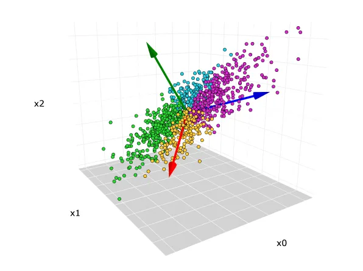
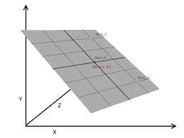
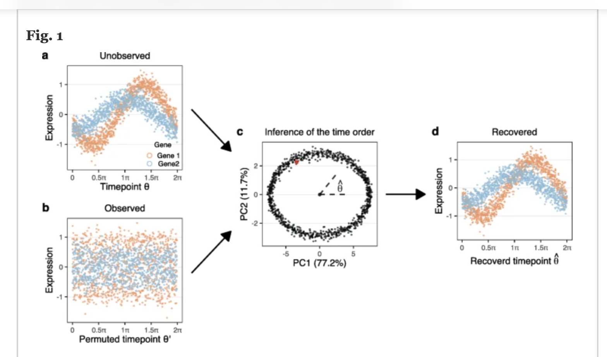

```{r setup, include=FALSE}
knitr::opts_chunk$set(echo = FALSE)
library(MVT)
library(xtable)
# library(kableExtra) # HTML-oriented; not used in this deck
library(sjPlot)
library(sjmisc)
library(sjlabelled)
# library(plotly) # HTML widgets are avoided in this deck
library(scater)
library(scran)
#library(org.Hs.eg.db)
library(DescTools)
library(scDiagnostics)
library(SingleCellExperiment)
library(isotree)
library(ggplot2)
library(dplyr)
```

## Outline

- I will talk primarily about principal component analysis (PCA) 
- as I feel it is often misunderstood and under used
- there are many challenges when analyzing high dimensional molecular data 
- with spatial data (either expression, proteomics) additional challenges arise when trying to understand how changes might be related to nearby anatomical structures, tumor or disease etc
- I will also describe and give some examples of *isolation forests* which are really nice (and easy to use) tools for finding outliers/anomalies and for clustering


## Introduction

- Modern molecular biology has progressed rapidly on based primarily on the development of high throughput assays that allow us to measure tens of thousands to millions of features across large populations (e.g. cells, individuals).

- As a result we typically have data represented in arrays with N rows and M columns, where N and M are often very large.

- We are often interested in finding out if there are lower dimensional representations of the data that can be used to understand the relationships that exist.

- for spatial data we also have the x-y coordinate of the original cells

## Rationale

- principal components provides a decomposition of the data where directions are associated with maximal variation in the data
- using these directions as a basis for identifying problems with an analysis is helpful both because of the maximality and the orthogonality 

- we can use PCA for dimension reduction, but that isn't its only use 

- in some important cases model checking is greatly simplified 


## What is an embedding?

- An embedding is a numerical representation of an object—such as a word, cell, image, document, or sample—as a vector in a geometric space, 

- the idea of an vector space embedding is to take high dimensional data and represent it as an element in some $p$ dimensional space

- in mathematics we might start with a matrix X that has $n$ rows and $p$ columns and we want to find a representation as a different matrix Y with n rows and $k << p$ columns

- for embeddings like UMAP and t-SNE usually we consider k = 2 or 3

## AI uses of embeddings

- many of the recent developments in AI make use of neural networks and other algorithms to create embeddings for things that do not initially fit in to a matrix like structure
- eg. images can be processed to yield embeddings in some $k$ dimensional vector space
- text processing, like that done by large language/transformers/foundation models also fit into this framework
- given $n$ inputs we get for each a $k$ dimensional vector
- the architecture that produced the embedding typically has the ability to take any point in the embedding space and turn it back into the object (generative part)
- for images you can provide a $k$ dimensional vector as input and get back an image
- for text completion (what most LLMs are base on) you put in a vector and get back a probability distribution on the next most likely word in the sentence.


## Dimension reduction


- PCA is sometimes used to reduce dimensions and it has the property that
For centered data matrix $X$, the rank-$k$ PCA approximation solves

$$
\widehat X_k
=
\arg\min_{\operatorname{rank}(Z) \le k}
\|X - Z\|^2 
$$
- which says it is the best squared error approximation to X with rank $k$

## Diagnostics
 
 - there seems to be little research or practical approaches to answering questions of the form:  "How well does the dimensionality reduction work?"
 
 - we might want to know if there are specific features of the data that were obscured by the dimension reduction method being used
 
  - it seems like there are opportunites to develop tools that can help identify the effects of any processing or transforming of the data

## PCA

- Principal Components Analysis is a multivariate method that helps you understand the structure of data that have been collected on $N$ individuals and $p$ variables. 
- Each individual can be represented by a point in $p$ dimensional space. 
- Our motivating example will be test scores on $N=88$ students across $p=5$ topics.The first two exams were closed book, the last 3 open book.

```{r data}
data(examScor)
head(examScor, n=3)
```

## Principal Components {.figure-left}

{width=45%}

- We will refer to the data matrix as $\mathbf{X}$, and each row as $\mathbf{x}_i$ = $(x_{i,1}, x_{i,2}, \ldots,x_{i,p})$.
- We can see in the picture that we could rotate the coordinate axis to align differently with the data
- There are many possible rotations, but we want to consider one where the axis are oriented towards directions of greatest variation in the point cloud.

## Three important points {.figure-left}

{width=45%}

- If we rotate the coordinate axis, as in the plot, the relationship between the data points has not changed at all.

- The data matrix ($\mathbf{X}^{\prime}$)  has $N$ rows and $p$ columns.

- The PCs are chosen to be orthogonal

- My main source:  *Multivariate Analysis*, Mardia, Kent, Bibby (1979)...which is still relevant and accurate today...

## Simple PCs (Appendix for more details)

- The PCs provide us with an alternative set of coordinates. 
- The first PC corresponds to the direction of most variation in the $\mathbf{x}$'s.  Note that rescaling the $\mathbf{x}$'s would clearly affect the PCs.
- After we compute the PCs we have three quantities of interest:
  1. The variability in each of the new directions (eigenvalues).
  2. The eigenvectors that form the rotation matrix that maps centered original variables into the new principal component coordinates
  3. The scores : the coordinates of the data points in the new coordinate system.

## Centering and Scaling

- it is common to center the data before computing the PCA decomposition
- this essentially makes the origin in the new coordinate system correspond to the per-variable mean vector (one could use other measures of center)
- the PCs are **not invariant** to rescaling
- the argument in favor of rescaling is that it will tend to put the variables on a more equal footing
- but rescaling may be problematic in some settings (eg when some features are more important) and careful consideration of whether or not to rescale is essential


## Motivating Example

- Since we have five covariates, each student's score can be represented in 5-D space.
- The principal components give us a different coordinate system than the one based on the exam scores.
- the default for `prcomp` is to *center* but not *scale* the input

```{r pca}
v1 = prcomp(examScor)
v1
```

## How to think about the PCs

- The rotation matrix, in the previous slide tells you how to compute the new, 5 dimensional values.  
- The value for PC1 is the linear combination (inner product) of the original scores with the values in the rotation matrix from the column labeled PC1, the second from PC2, and so on.

- We can compute a new $N$ by $k$ matrix, where for each of the $k$ dimensions we can compute the new value for each individual.  
- This gives us a set of five columns (rows are students, columns are variables) that are equivalent to the original data. 
- The points are in some sense identical; we have changed coordinate systems.


## Back to the PCs
 Let's have a look at the coefficients - these are sometimes called *rotations*.
```{r}
v1$rotation
```
- We can then see that PC1 is pretty close to the average, across all the exam scores.
- PC2 is a contrast between the closed book and open book exams.
- What do you think PC3 is representing?

## The Rotated Variables

- We can also compute the data matrix in the new reference frame - sometimes called the *rotated variables*
```{r, echo=TRUE}
head( v1$x, 4)
```

## The Rotated Variables

- They are uncorrelated
```{r, echo=TRUE}
round(cor(v1$x), digits=3)
```

## The Variances


```{r echo=TRUE}
v1$sdev
```

- the largest SD is about 26 and the smallest close to 6
- if the data followed a multivariate Normal distribution (it does not) these would tell us about the size of the ellipses that describe the data

Notice that if we compute the SD for each column we get back the singular values.
```{r, echo=TRUE}
apply(v1$x, 2, sd)
```


## The Null Space

- Sometimes we have $p$ columns, but the point cloud really only occupies some lower dimensional space.
{width=30%}
- in the rotated coordinate system we only need 2 dimensions, so one of the rotated variables will be zero 


## The Null Space - Dimension Reduction

- It would be quite unusual in a real world example where there is stochastic variation between individuals to find a case where one or more of the eigenvalues is exactly zero
- So we use a cut-off of some form that says that if the variability in one direction is smaller than $\eta$ we don't think that dimension will be very helpful.
- In our single cell analysis pipeline we will typically choose some fairly large number of PCs (eg 50) to use for clustering the data, this is a form of dimension reduction
- if we simply use the first 50 eigenvalues to perform the embedding then we have effectively mapped all the other directions, for all individuals, into zero

## PCA in Biology

- in many different molecular biology assays we collect data on individuals or cells
- that data could be genotypes, gene expression values, methylation etc
- the data structures for these assays are usually transposed from those used above for the exam scores on students
- in biological examples there tend to be many more quantities that are measured than there are individuals
- so for most of these examples we will be working with the transpose of the data matrix
- we are often interested in finding a low dimensional set of features that explain most of the between individual variation

## Case Study with Single cell RNA-seq experiments

- In a single cell experiment we typically have hundreds to thousands of cells.
- We have 10's of thousands of genes....
- So each cell is a point in some 10-40K space...but we think that the there are useful summaries
- We want to use PCA analysis as a way to do some form of dimension reduction - to those directions where there is a lot of variation in the data.
- outliers can greatly skew the results and we need to be careful to ensure that our analysis is not too reliant on a few observations.

## The basics of the process
- get your single cell data and do QA/QC to remove genes (rows) and cells (columns) that seem to have technical or biological reasons to be be suspect
- log transform and size normalize the data
- do some sort of filtering for the top K most variable genes (K and how you measure variable are parameters)
- do PCA 
- use the first M PCs to do clustering
- revert back to the full count matrix and use UMAP and tSNE to visualize

## Set up the data

- We will examine the single cell data from workflow #3 in the OSCA book
- http://bioconductor.org/books/3.17/OSCA.workflows/
- This is a peripheral blood mononuclear cell (PBMC) dataset from 10X Genomics (Zheng et al. 2017). The data are publicly available from the 10X Genomics website, from which we download the raw gene/barcode count matrices, i.e., before cell calling from the CellRanger pipeline.
The data were processed as described in that workflow.

```{r, echo=FALSE, warning=FALSE, message=FALSE}
library("DropletTestFiles")
library("scater")
#load("sce.pbmc.rda")
load("sc_exp_norm_trans.rda")
load("Subclusters.rda")
clusters = Subclusters
pcs = reducedDims(sc_exp_norm_trans)$PCA

```

```{r cluster-colors, include=FALSE}
cluster_colours <- clusters
cols <- colors()[17 * as.numeric(levels(cluster_colours))]
cols[10] <- "red"
levels(cluster_colours) <- cols
v1 <- as.character(cluster_colours)
```
## Variance Explained

```{r, echo=TRUE}
pct_var = attr(reducedDims(sc_exp_norm_trans)$PCA, "percentVar") |> 
   round(digits = 1)
pct_var
```
- notice that after about 12 components we are at .3 and then quickly just .2 over and over
- think back to the earlier comment that it could be useful to test if those later values are all equal...

## LM on Clusters

Here we consider a set of models, one for each PC, where we ask how much of the variation in the PC is explained by the clusters

The variables $1_{Cj}$ are indicator variables, the $i^{th}$ element is 1 if the
$i^{th}$ observation is in the $j^{th}$ cluster and 0 otherwise.

$$
 PC_l = \beta_1 \cdot 1_{C1} + \cdots + \beta_k \cdot 1_{Ck} + \epsilon
$$
We can fit this model for each of some selected number of PCs.


## Boxplot on Clusters

```{r, echo=FALSE}
##Subclusters is the set of clusters
pc1 = pcs[,1]
lm1 = lm(pc1~clusters-1)

boxplot(pc1~clusters, ylab="PC1", main="PC1 scores by Cluster Assignment")
```

- note that this shows PC1 is essentially a contrast between a subset of the clusters

## Is there info in the PCs we have not used?

- we regress each PC in turn against the cluster labels and get the multiple $R^2$
- for each regression, the multiple $R^2$ tells us about how much of the variation in that PC is explained by the clusters
- if that value is especially low, as it is for PC6 - then that direction is not really reflecting the clustering - something else is driving the variability in that direction


```{r, echo=FALSE}
multR2 = sapply(1:9, function(x) {
  summary(lm(pcs[,x]~ clusters - 1))$adj.r.squared
})
#round(multR2, digits=4)
```

## Multiple $R^2$ per PC
- note that for PC6 the multiple $R^2$ is very close to zero, suggesting that the variation in that direction is not described by the clusters 
```{r plotPCR2, echo=FALSE}
plot(1:9, round(multR2, digits=4), xlab="PC", ylab= "Prop. Var. Explained", pch=19)
```


## Some opportunities

- you will recall that the PCs are orthogonal and that the variances in each of the different directions add up to the total variation in the data

- each of the regressions that we carried out computed a multiple $R^2$ value that represents the proportion of variability in the Y's that is explained by the X's

- so we could (and the math is straightforward) compute the total variability in the Y's that is explained by the X's by summing the producs of the eigenvalue * $R^2$ and potentially get a test of whether one clustering method is better than others

## First PC4
- we note that for the first three PCs the $R^2$ is larger than $0.8$, but drops to around $0.6$ for PC4
- we plot PC4 vs PC1 
- what is that set of unusual looking points?
```{r, echo=FALSE}
v1 = clusters
cols = colors()[17*as.numeric(levels(v1))]
cols[10] = "red"
levels(v1) = cols
v1 = as.character(v1)
plot(pcs[,4], pcs[,1], xlab="PC4", ylab="PC1", col=v1)
```


## PC4

- we identify cluster 9 as being the unusual cluster in our plot
- we now find the highly variable genes within cluster 9
- so we only use the cluster 9 cells
```{r, echo=TRUE}
exprs9 = assays(sc_exp_norm_trans)$logcounts[, clusters==9]
sdbyg9 = rowSds(exprs9)
names(sdbyg9) = row.names(exprs9)
topsdbyg9 = sort(sdbyg9,dec=TRUE)[1:50]
topsdbyg9[1:10]
```
- some of these are platelet factors, the first is a sign of platelet activation

## Platelets

- we produce a density plot of gene expression values for PPBP within cluster 9

```{r, echo=FALSE, fig.height=4}
save(exprs9, file="exprs9.rda")
plot(density(exprs9["PPBP",]), main="PPBP within cluster 9")

```

## Plot all four genes by groups

```{r, echo=FALSE}
vv = colData(sc_exp_norm_trans)
vv = cbind(vv, clusters=clusters)
colData(sc_exp_norm_trans) = vv
```

```{r, echo=FALSE}
plotExpression(sc_exp_norm_trans, features=names(topsdbyg9)[1:4], x="clusters", colour_by="clusters")
```


## Summary of our Findings about PC4

- our regression of the PCs against the cluster identities suggested that in the direction of PC4 there was some variability that was not being explained by the clusters
- we found that most of that variation was contained in one cluster, cluster 9
- when we looked at the highly variable genes in that cluster we found that the top four seemed to be coordinately expressed
- these genes were involved in platelet activation
- but we have not proven anything, and we would want to follow up with a biologist who is knowledgeable about platelets to see if there are further experiments we should carry out
```{r rowSums, eval=FALSE, echo=FALSE}
table(rowSums(exprs9S)==0)
```

## Now for PC6 

- we now return to the regression analysis and consider PC6, where $R^2$ was about $0.03$
- first plot PC6 vs PC1 and as we see there is no real pattern in the PC6 direction
- we do see the separation in the PC1 direction, but that is not relevant

```{r, echo=FALSE, fig.height=3.5}
plot(pcs[,6], pcs[,1], xlab="PC6", ylab="PC1", col=v1)
```

## Boxplot

- now look at boxplots of PC6 split by cluster
- we see no real pattern
- the clusters have very similar values in this direction

```{r, echo=FALSE, fig.height=3.5}
plot(pcs[,6]~clusters, xlab="Cluster ID", ylab="PC6", col=v1)
```

## What might be happening

- we tested for correlation of PC6 with zero fraction - none
- we tested for correlation with sizeFactor - none
- let's look at the loadings in the rotation matrix


## The rotation matrix...

- the rotations tell us about the "loadings" on each of the genes for each PC

- we can see that four genes have very large (relative to the others) weights
```{r echo=TRUE}
rotation = attr(reducedDims(sc_exp_norm_trans)$PCA, "rotation")
sort(round(abs(rotation[,6]),digits=3),dec=TRUE)[1:15]
```

## A little more about the rotation

- first see if the values are all positive, negative or a mixture
- look to see what the most negative loadings are
```{r rotVals, echo=TRUE}
rotation[c("JUN", "FOS","JUNB","DUSP1"),6]
sort(round(rotation[,6], digits=3),dec=FALSE)[1:5]
```


## Part 2: Examine Batch Effects

 - PCA can be used to examine and understand batch effects
 - When two samples (batches) have been integrated, using one of the many tools available there is still a chance that there are differences between the data points that are due to batch
- this analysis is valuable any time you are combining data (not just for biology, or single cell)
- after combining the data, we recommend using PCA on that combined data and regressing those PCs against batch
- our example comes from the `scMerge` package
- the data consist of 200 cells and 1047 genes from two batches of mouse ESCs
- https://www.ebi.ac.uk/biostudies/arrayexpress/studies/E-MTAB-2600


```{r setupbatch, echo=FALSE, warning=FALSE}
library(scMerge)
data(example_sce)
assay(example_sce, "logcounts") <- as.matrix(assay(example_sce, "logcounts"))
#assay(reference_sce, "logcounts") <- as.matrix(assay(reference_sce, "logcounts"))
data("segList_ensemblGeneID", package = "scMerge")
example_sce = scater::runPCA(example_sce, exprs_values = "logcounts")
```

## Batch Effects in Single Cell Experiments

:::: {.columns}
::: {.column width="50%"}
```{r plotting-before, echo=FALSE, warning=FALSE, fig.width=5, fig.height=4, out.width="100%"}

##plot the unmerged
scater::plotPCA(example_sce, point_size=3,
                colour_by = "cellTypes", 
                shape_by = "batch")
```
:::

::: {.column width="50%"}
```{r plotting-after, echo=FALSE, warning=FALSE, fig.width=5, fig.height=4, out.width="100%"}
##merge
scMerge2_res <- scMerge2(exprsMat = logcounts(example_sce),
                         batch = example_sce$batch,
                         ctl = segList_ensemblGeneID$mouse$mouse_scSEG,
                         verbose = FALSE)

assay(example_sce, "scMerge2") <- scMerge2_res$newY

set.seed(2022)

example_sce <- scater::runPCA(example_sce, exprs_values = 'scMerge2', name="mergedPCA")    

scater::plotPCA(example_sce, dimred="mergedPCA", point_size=3,
                colour_by = "cellTypes", 
                shape_by = "batch")
mergedPCA = reducedDim(example_sce, "mergedPCA")
percentVar = attributes(mergedPCA)$percentVar
```
:::
::::

- the batch correction looks pretty good 
- but how do we know?

## Batch Correction

- we can take that merged data, compute a PCA on it and then regress each PC in turn against batch
- the percentage of variation explained by the first 10 PCs (merged data) is: 
`r round(percentVar[1:10], digits=1)`
- only the first 3 PCs describe more than 75% of the variation, so we will consider the first 4 PCs

$$
 PC_l = 1 + \beta_1 \cdot 1_{B1} + \epsilon
$$
```{r batchreg, echo=FALSE}
rsums = vector("list", length=5)
for(i in 1:5) rsums[[i]] = summary(lm(mergedPCA[,i] ~ example_sce$batch))
mR2 = sapply(rsums, function(x) x$adj.r.squared)
```
- and for the first 4 PCs we get adjusted multiple R^2 of `r round(mR2, digits=2)`

## Batch Correction
- so things look pretty good - but is there something more we should/could do?
- it might be good to look at whether or not the correction is good for all cell types?


```{r batchreg1}

summary(lm(mergedPCA[,1] ~ -1 + cellTypes * batch, data=colData(example_sce)))

```


## Cell Type and Batch Correction

- so there seems to be a problem with at least one of the cell types
- now we will turn to functionality in the `scDiagnostics` package to try and figure out what
- we split the batch-corrected data back into the two separate data sets, B2 and B3
- we compute PCA on the batch corrected B2 data and project the batch corrected B3 data into that space
- if batch correction went as anticipated then the resulting data points should be intermingled, for all three groups
- but there could be differences that are cell type dependent and we should see those using this analysis

## Cell Type and Batch Correction

- workflow is often:  find highly variable genes in one batch; find those in the other; find overlap
- use the overlapping genes to do batch correction
- this might not work well if the numbers of cells of different types are not similar

## Cell Type and Batch Correction

```{r bcviascDiag, echo=FALSE, message=FALSE, warning=FALSE}
exB2 = example_sce[,example_sce$batch=="batch2"]
exB3 = example_sce[,example_sce$batch=="batch3"]

exB2$cellTypes <- as.character(exB2$cellTypes)
exB3$cellTypes <- as.character(exB3$cellTypes)

exB2var_genes <- getTopHVGs(exB2, n = 100)
exB3var_genes <- getTopHVGs(exB3, n = 100)

# Calculate the overlap coefficient between the reference and query HVGs
overlap_coefficient <- calculateHVGOverlap(reference_genes = exB2var_genes, 
                                           query_genes = exB3var_genes)

# Display the overlap coefficient
#overlap_coefficient

##now lets look at projecting one into the other

exB2 <- scater::runPCA(exB2, exprs_values = 'scMerge2')
exB3 <- scater::runPCA(exB3, exprs_values = 'scMerge2')

assay(exB3, "scMerge2") = as.matrix(assay(exB3, "scMerge2"))

plotCellTypePCA(query_data=exB3, reference_data=exB2, query_cell_type_col = "cellTypes",
                 ref_cell_type_col = "cellTypes", assay_name = "scMerge2",
                pc_subset = 1:3)


```

## Understanding projections

- when we project (or embed) one data set into the space of another we pick some small number of PCs to use 
- e.g. project the query data set into the space spanned by the first 10 PCs of the reference
- those 10 PCs have a very good interpretation for the reference data set
- they represent the 10 highest directions of variability, but they don't mean that for the query
- for the query there might be other directions that are important
- one useful diagnostic is to examine the projection of the query into the null space (i.e. use the other PCs)
- if we only use the first 10 eigenvectors then our data will be 10 dimensional and all the other directions have been projected into 0


## Part 3: Isolation Forests

- finding anomalous points in high dimension can be very challenging
- in some cases small number of similar but unusual points might be the most interesting findings
- the isotree package (	10.32614/CRAN.package.isotree) provides a good R implementation
- Liu, Fei Tony, Kai Ming Ting, and Zhi-Hua Zhou. “Isolation forest.” 2008 Eighth IEEE International Conference on Data Mining. IEEE, 2008.

- the key observation was: unusual observations are often easier to isolate by choosing a small number of random split points for the data

## What is an Isolation Forest?


- An is built out of isolation trees

- the algorithm takes a bootstrap (or random) sample and chooses a random split point for one variable
- all observations are divided into two nodes based on that variable and split point
- this algorithm is applied recursively to each node until (conceptually) all observations are in a node by themselves
- very many such trees are built, creating a forest
- and one can compute an anomaly score for each element of the data set

- one can also use an isolation forest to see if other data points are in-liers or out-liers

## Single-Tree Isolation Demo

```{r single-tree-isolation-demo, message=FALSE, warning=FALSE, fig.width=8, fig.height=4.8}

set.seed(7)

dat <- data.frame(
  x = c(rnorm(120, 0, 0.8), 3.8),
  y = c(rnorm(120, 0, 0.8), 3.5),
  type = c(rep("Typical data", 120), "Outlier")
)

typical_point <- dat[which.min(dat$x^2 + dat$y^2), ]
outlier_point <- dat[dat$type == "Outlier", ]

isolation_path <- function(data, target, label, max_depth = 8) {
  box <- list(
    xmin = min(data$x) - 0.4,
    xmax = max(data$x) + 0.4,
    ymin = min(data$y) - 0.4,
    ymax = max(data$y) + 0.4
  )

  steps <- data.frame()

  for (depth in 0:max_depth) {
    inside <- data |>
      filter(
        x >= box$xmin, x <= box$xmax,
        y >= box$ymin, y <= box$ymax
      )

    steps <- bind_rows(
      steps,
      data.frame(
        demo = label,
        depth = depth,
        xmin = box$xmin,
        xmax = box$xmax,
        ymin = box$ymin,
        ymax = box$ymax,
        n_points = nrow(inside)
      )
    )

    if (nrow(inside) <= 1) break

    split_var <- sample(c("x", "y"), 1)

    if (split_var == "x") {
      split_value <- runif(1, box$xmin, box$xmax)

      if (target$x <= split_value) {
        box$xmax <- split_value
      } else {
        box$xmin <- split_value
      }
    } else {
      split_value <- runif(1, box$ymin, box$ymax)

      if (target$y <= split_value) {
        box$ymax <- split_value
      } else {
        box$ymin <- split_value
      }
    }
  }

  steps
}

outlier_path <- isolation_path(dat, outlier_point, "Outlier")
typical_path <- isolation_path(dat, typical_point, "Typical point")

paths <- bind_rows(outlier_path, typical_path) |>
  mutate(
    demo = paste0(
      demo,
      "\n",
      max(depth) + 1,
      " random splits shown"
    )
  )

targets <- bind_rows(
  mutate(outlier_point, demo = unique(paths$demo)[grepl("Outlier", unique(paths$demo))]),
  mutate(typical_point, demo = unique(paths$demo)[grepl("Typical", unique(paths$demo))])
)

ggplot() +
  geom_point(
    data = dat,
    aes(x, y),
    color = "grey65",
    size = 1.8,
    alpha = 0.75
  ) +
  geom_rect(
    data = paths,
    aes(
      xmin = xmin, xmax = xmax,
      ymin = ymin, ymax = ymax,
      color = depth
    ),
    fill = NA,
    linewidth = 0.8
  ) +
  geom_point(
    data = targets,
    aes(x, y),
    color = "firebrick",
    size = 3.8
  ) +
  facet_wrap(~ demo) +
  scale_color_viridis_c(
    option = "plasma",
    name = "Split depth"
  ) +
  coord_equal() +
  labs(
    title = "A single isolation tree repeatedly cuts the space",
    subtitle = "Outlying points often become isolated after fewer random splits",
    x = "Feature 1",
    y = "Feature 2"
  ) +
  theme_minimal(base_size = 15) +
  theme(
    panel.grid = element_blank(),
    strip.text = element_text(face = "bold"),
    legend.position = "bottom"
  )
```

## Isolation forests and distances

- you can calculate distances between pairs of points based on how many splits it takes to separate them

- or compute a proximity score by looking at how many trees two points share the same terminal node

- these distances can be used for clustering or other purposes

## Label Transfer using isolation forests

- if one has a reference data set for cell types, say
- then for each different cell type you can create an isolation forest
- and from the query data set you can test whether a cell is an in-lier or an out-lier for each of
the different reference cell types
- this would allow you to identify cells that look different from everything in the reference
- the method is not overly sensitive to the sizes of the reference cells 

- the method does not seem to be too sensitive to the number of features used

## An example

- we show an example based on the `scDiagnostics` package applied to the MERFISH
data from Cadinu et al. Cell 187, 2010–2028 (2024)

- the data profile a mouse model of colitis over a timecourse of 21 days,
with peak induction of colitis at Day 9. 

- We compared the mouse colon at two timepoints:
Day 0 (healthy baseline) and Day 9 (Dextran Sodium Sulfate [DSS]-induced colitis).

- We used Day 0 as *normal* and then compared fibroblasts at day 9 to an isolation forest built on fibroblasts at day 0

## Figure A {.figure-slide}

{width=100%}

## Processing the samples:

 - from the Day 0 reference we removed all cells annotated
as inflammation-associated (inflammation-associated epithelial cells [IAE], inflammation-
associated fibroblasts [IAF], and inflammation-associated smooth muscle cells [IASMC])
-  to ensure the reference represented a strictly homeostatic baseline

- we created a we calculated an ECM homeostasis signature score using five canonical
matrisome genes: Col1a2, Timp2, Col6a1, Sparc, and Dpt. 

- the score was computed as the mean log-normalized expression of these genes, winsorized at 1.5 to reduce
the influence of extreme values, and scaled by a factor of 2 for visualization

- we then applied the detectAnomaly function to the fibroblast lineage

- projecting query fibroblasts onto the PCA manifold defined by Day 0 reference fibroblasts and calculating anomaly scores using the isolation forest algorithm with a threshold of 0.5.


## Figure B {.figure-slide}

{width=100%}

## Thanks 
- this was work done while collaborating with the teaching teams at CSAMA (https://csama2025.bioconductor.eu/)
- and Summer School Biological Data Science in Uzhhorod, Ukraine, July 2023
- with lots of input from the students and faculty
- Anthony Christidis, HMS for work on scDiagnostics
- Wolfgang Huber (EMBL)

## References

- Modern Statistics for Modern Biology (Holmes and Huber); https://www.huber.embl.de/msmb/
- Elements of Statistical Learning (Hastie, Tibshirani and Friedman) https://hastie.su.domains/Papers/ESLII.pdf
- Modern Applied Statistics with S. Fourth Edition, by W. N. Venables and B. D. Ripley; MASS package in R
- CRAN https://cran.r-project.org/ Task Views
- Wikipedia pages are pretty good for a simple introduction, but often do not provide appropriate guidance/interpretation

## Appendix


## Projections and the Null Space

-

```{r projPCANull}
pp1 = projectPCA(exB3, exB2,query_cell_type_col = "cellTypes",
                 ref_cell_type_col = "cellTypes", assay_name = "scMerge2",
                pc_subset = 1:10)

varsB3 = apply(pp1[,1:10], 2, sd)
varsB2 = apply(reducedDim(exB2, "mergedPCA"), 2, sd)[1:10]
plot(varsB2, varsB3, xlab="St Dev B2", ylab="Std Dev B3", pch=19, col="slateblue")
abline(a=0,b=1,lwd=2,col="cornflowerblue")
```


## PCA with Cyclic data
- from Universal prediction of cell-cycle position using transfer learning, Genome Biology volume 23, Article number: 41 (2022)
{width=65%}


